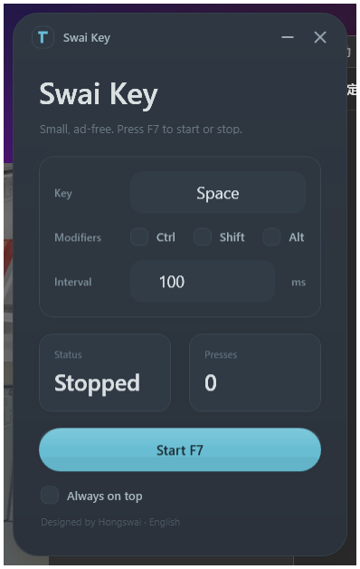
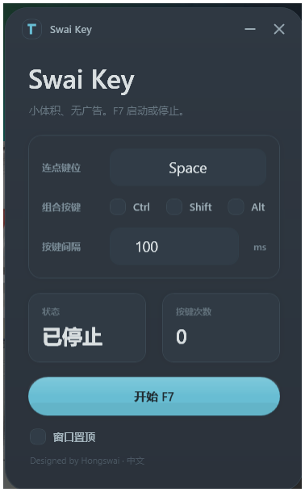

# Swai Key — Tiny Keyboard Automation Tool

[中文](#中文)

A tiny, portable keyboard automation tool for Windows.

No installation.  
No ads.  
No background services.  
Just launch and use.

Built with native WPF instead of Electron.

Only ~70KB.



---

## Features

- Simulate repeated keyboard presses
- Supports modifier key combinations
- Custom press intervals
- Start / stop instantly with F7
- Always-on-top window option
- Native WPF interface

---

## Use Cases

- Games
- Repetitive office tasks
- Keyboard testing
- Accessibility assistance

---

## Safety

- No network connection
- No telemetry
- No background services
- Open source

---

## Download

- Repository: `publish/键盘连点器WPF版.exe`
- Lanzou Cloud: [Download](https://cig.lanzoul.com/iRqAX3ppkqsd)
- Password: `1111`

---

## Build

Requires Windows and .NET Framework 4.8 Developer Pack.

```powershell
.\build.ps1
```

---

## License

© 2026 Hongswai

This project is licensed under the MIT License.

---

# 中文

[English](#swai-key--tiny-keyboard-automation-tool)

一个极小体积、免安装、无广告的 Windows 键盘自动化工具。

无需安装。  
无广告。  
无后台服务。  
双击即用。

使用原生 WPF 开发，而不是 Electron 网页套壳。

仅几十 KB。



---

## 功能

- 自动重复按键
- 支持 Ctrl / Shift / Alt 组合键
- 支持自定义按键间隔
- 支持 F7 一键启动 / 停止
- 支持窗口置顶
- 原生 WPF 界面

---

## 适用场景

- 游戏挂机
- 重复办公操作
- 键盘测试
- 辅助操作

---

## 安全性

- 不联网
- 不收集数据
- 无后台服务
- 开源可见

---

## 下载

- 本仓库：`publish/键盘连点器WPF版.exe`
- 蓝奏云：[下载地址](https://cig.lanzoul.com/iRqAX3ppkqsd)
- 密码：`1111`

---

## 构建

需要 Windows 和 .NET Framework 4.8 Developer Pack。

```powershell
.\build.ps1
```

---

## 许可证

© 2026 Hongswai

本项目使用 MIT License。
