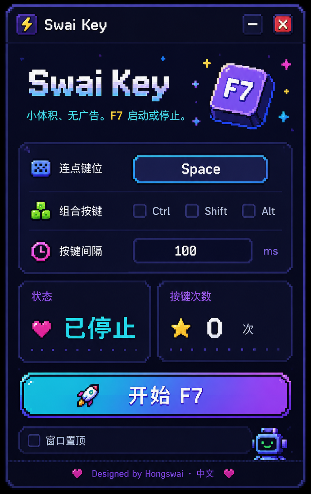
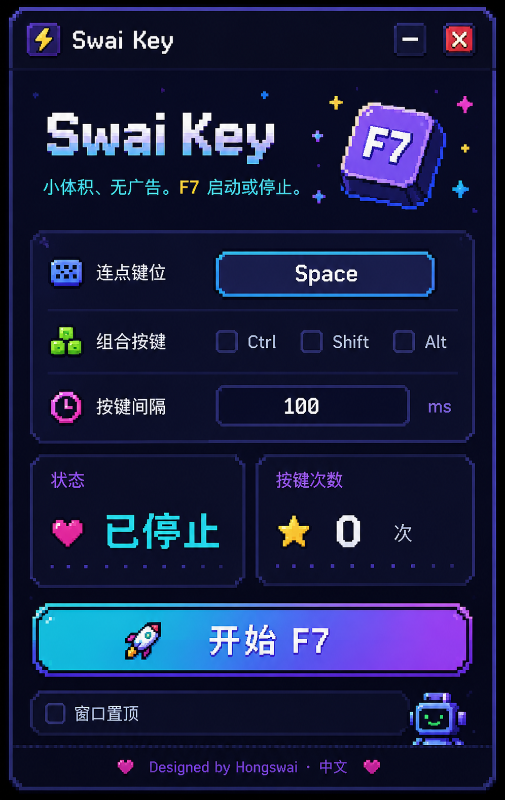

# Swai Key

Small keyboard auto key presser for Windows.

[中文](#中文) | [English](#english)

---

## 中文



### 这是什么

Swai Key 是一个轻量、紧凑的 Windows 键盘自动按键工具。

它只保留重复按键需要的核心功能：选择键位、设置间隔、选择组合键，然后用按钮或 F7 启动和停止。

### 主要功能

- 选择需要自动按下的键位。
- 支持 Ctrl / Shift / Alt 组合键。
- 自定义按键间隔。
- 使用 F7 全局热键启动或停止。
- 支持窗口置顶。
- 无广告、无需登录、本地运行。

### 下载

从 GitHub Releases 下载：

```text
Swai Key.exe
```

备用下载：

[蓝奏云下载](https://cig.lanzoul.com/iuHE63pyrc6d)

```text
密码：1111
```

文件校验：

```text
SHA256: 8B9794110FE0C0669DA6C288F9070A467C6FCCA2FAECF1C127D3C696FA518415
```

### 使用方法

1. 打开 `Swai Key.exe`。
2. 点击键位输入框，按下目标键。
3. 如果需要组合键，勾选 Ctrl / Shift / Alt。
4. 设置按键间隔，单位为毫秒。
5. 点击 `开始 F7`，或按 F7 启动和停止。

### 语言

Swai Key 会根据 Windows 当前界面语言显示中文或英文。点击底部的 `Designed by Hongswai · 中文` / `Designed by Hongswai · English` 可以手动切换语言。

### 隐私与安全

- 不需要账号。
- 不上传任何个人数据。
- 不连接云服务。
- 因为包含全局热键和自动键盘输入功能，部分安全软件可能提示风险。请只从可信来源下载，并使用上方 SHA256 校验文件。

### 常见问题

**为什么 F7 没反应？**

请确认 Swai Key 正在运行。如果其他软件已经占用 F7，热键可能会冲突，你仍然可以使用窗口里的按钮启动或停止。

**可以在游戏里使用吗？**

技术上它只发送键盘输入。不同游戏和平台规则不同，请先确认目标软件是否允许这类工具。

**需要安装吗？**

不需要。`Swai Key.exe` 是便携版，下载后直接运行。

---

## English



### What It Is

Swai Key is a small, compact keyboard auto key presser for Windows.

It keeps only the controls needed for repeated key presses: choose a key, set an interval, optionally add modifiers, then start or stop with the button or F7.

### Features

- Select the target key.
- Use Ctrl / Shift / Alt modifiers.
- Set a custom key press interval.
- Start or stop with the global F7 hotkey.
- Keep the window always on top.
- Ad-free, no account, local only.

### Download

Download from GitHub Releases:

```text
Swai Key.exe
```

Alternative download:

[Lanzou Cloud Download](https://cig.lanzoul.com/iuHE63pyrc6d)

```text
Password: 1111
```

File verification:

```text
SHA256: 8B9794110FE0C0669DA6C288F9070A467C6FCCA2FAECF1C127D3C696FA518415
```

### How to Use

1. Open `Swai Key.exe`.
2. Click the key field, then press the target key.
3. Enable Ctrl / Shift / Alt if you need modifiers.
4. Set the interval in milliseconds.
5. Click `Start F7`, or press F7 to start and stop.

### Language

Swai Key displays Chinese or English based on the current Windows UI language. Click `Designed by Hongswai · 中文` / `Designed by Hongswai · English` at the bottom to switch manually.

### Privacy and Safety

- No account required.
- No personal data upload.
- No cloud service connection.
- Because it uses a global hotkey and automated keyboard input, some security software may show a warning. Download from a trusted source and verify the SHA256 hash above.

### FAQ

**Why does F7 not work?**

Make sure Swai Key is running. If another app already uses F7, the hotkey may conflict. You can still use the button in the window.

**Can I use it in games?**

Technically, it only sends keyboard input. Different games and platforms have different rules, so check whether the target software allows this kind of tool.

**Does it need installation?**

No. `Swai Key.exe` is portable. Download it and run it directly.
